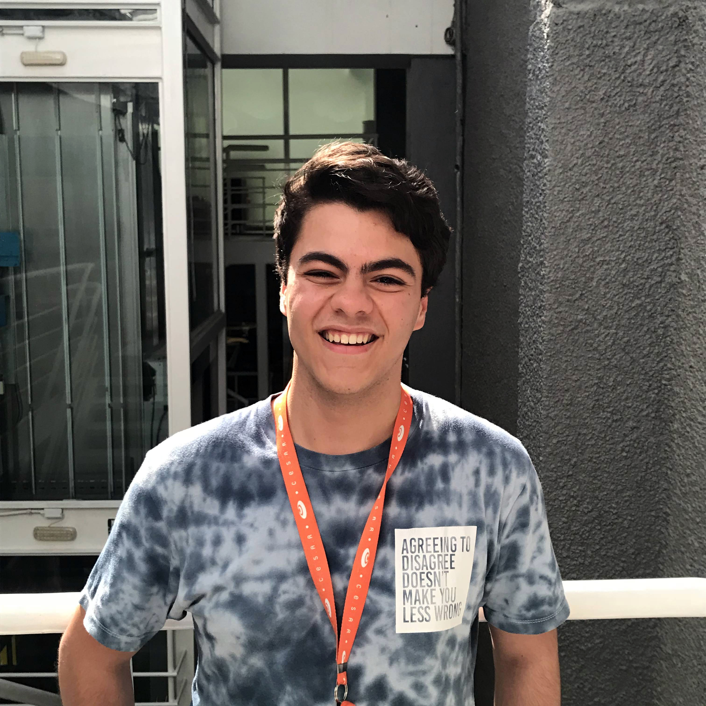

# ALPACK

## The Dream Team

> ALPACK is a team of \[six\] undergraduates from CESAR School - CESAR's school of Innovation, located in the Porto Digital area \(Recife, Brazil\).

### Alexandro Junior

Designer e Desenvolvedor de Jogos, 18 anos, formado no projeto NAVE em programação de jogos digitais e agora sigo cursando design no CESAR School. Especialista em desenvolvimento de IoT, participando como mentor de diversos workshops no LOUCo voltados para a melhoria da cidade. Participante de projetos como o Wereld, semifinalista do Technovation challenge 2016.

* **E-mail:** ajsj@cesar.school
* **LinkedIn:** [**https://www.linkedin.com/in/alexandrojunior/**](https://www.linkedin.com/in/alexandrojunior/) ****

### **Arthur Reis**

Estudante de Ciência da Computação do Cesar, 19 anos, sempre muito interessado em assuntos relacionados a computadores e astronomia. Se descobriu na área de forma natural. Com bastante interesse em outras culturas e línguas, principalmente da Ásia, atualmente estuda chinês e japonês. Tem bastante interesse em trabalhar com tecnologia relacionada a astronomia e música.

* **E-mail:** aor@cesar.school
* **LinkedIn:** [**https://www.linkedin.com/in/aoreis/**](https://www.linkedin.com/in/aoreis/)\*\*\*\*

### **Cecília Frazão**

Estudante de Design do Cesar, com 20 anos de idade, apresenta habilidades de desenho e trabalhos manuais como também tem conhecimento na área de arquitetura e administração. Além disso, é fluente em inglês e tem o nível básico de japonês. Tem interesse em trabalhar na parte de animação como também na área de jogos.Teve participação de trabalhar com UX e UI no Projeto NESS.  

* **E-mail:** cfp@cesar.school
* **Phone:**  +55 \(81\) 99812-9253

### **Kleber Santana**

Estudante de design da Cesar School, 24 anos de idade, possui grande conhecimento na área de jogos e gamificação, possui destreza com trabalhos manuais, tem experiência com edição de fotos e ilustrações digitais. Possui inglês avançado. Tem como objetivo principal trabalhar na área de jogos como Game Designer. Participação no Projeto NESS como UX e UI Designer.

* **E-mail:** kwssf@cesar.school
* **LinkedIn:** [**https://www.linkedin.com/in/kleber94/**](https://www.linkedin.com/in/kleber94/)\*\*\*\*

### **Leonardo Melo**

Aos 19 anos, abandonou o curso de Fisioterapia para seguir um caminho diferente. Foi saindo da zona de conforto e deixando a busca por estabilidade para trás que desenvolveu autoconhecimento e assertividade para encontrar-se em Ciência da Computação. Adquiriu conhecimentos em desenvolvimento de software, metodologias ágeis e resolução de problemas. Hoje, aos 21 anos, faz parte do time de devs da ALPACK.

* **E-mail:** lcbm@cesar.school
* **LinkedIn:** [**https://www.linkedin.com/in/leonardo-melo-3b4521137/**](https://www.linkedin.com/in/leonardo-melo-3b4521137/)\*\*\*\*

### **Pedro Henrique**

Com 17 anos de idade está seguindo o caminho que sempre sonhou, o da tecnologia, e mais especificamente a criação das novas tecnologias, visando revolucionar e melhorar o ambiente ao seu redor com os seus conhecimentos. É com esse objetivo que hoje é estudante de Ciência da Computação no CESAR school. Adquirindo e desenvolvendo habilidades relacionadas ao desenvolvimento de software e a resolução de problemas, sendo hoje parte do time de desenvolvedores do grupo ALPACK.

* **E-mail:** phjfg@cesar.school
* **Phone:** +55 \(81\) 98623-1559

|  |
| :--- |

